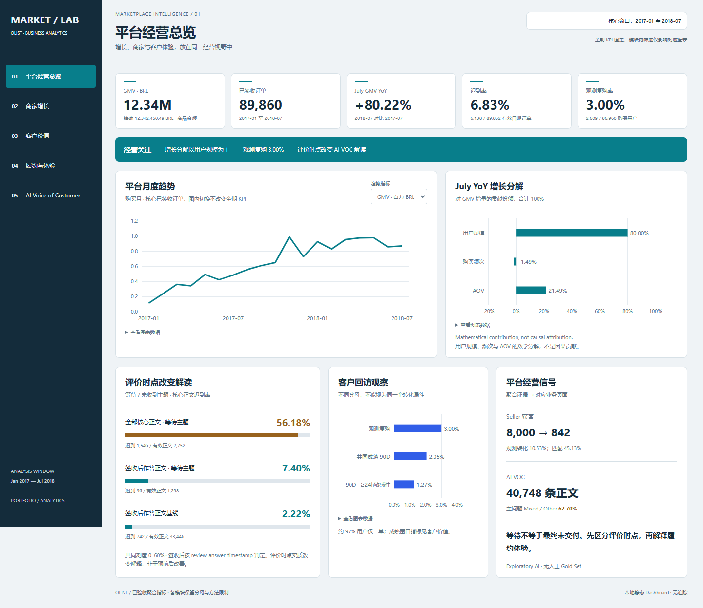

# AI-Powered Marketplace Operations & Seller Growth Analytics

使用 Olist 真实 Marketplace 数据，结合 SQL/Python、经营分析、履约分析和 AI VOC，诊断平台增长、Seller、Customer 与 CX 问题。



[Live Dashboard](https://wangdandanlh-source.github.io/olist-ai-marketplace-analytics/) · [Dashboard Source](dashboard/README.md) · [Business Report](report/olist_ai_marketplace_business_analysis.pdf) · [Methodology](docs/methodology.md)

## Project overview / Business questions

商家获取如何连接成交后的经营表现？平台增长来自量、频次还是客单价？低复购与履约体验提供哪些运营信号？AI 如何将葡语正文组织为可验证的主题？本项目交付包括交互式经营 Dashboard、10页 Business Analysis Report 与可复现分析代码。

## Key findings

- 核心期 2017-01 至 2018-07，89,860 个已签收订单，商品 GMV 12,342,450.49 BRL；July YoY +80.22%，其中用户规模数学贡献 80.00%，不是因果归因。
- 8,000 MQL → 842 Deals，观测转化 10.53%；仅 380 / 842（45.13%）商家匹配订单，无法判断渠道 ROI。
- 124 个共同成熟 90D 商家，GMV 中位数 694.65 BRL、均值 2,376.19 BRL；41 个最后 30D 无记录订单，是 inactivity signal，不是 churn。
- 全期观测复购 3.00%；共同成熟 90D 复购 2.05%，购买时间间隔 ≥24h敏感性为 1.27%；约 97% 用户仅一单。
- 迟到率 6.83%；签收后作答样本调整 OR 2.31（95% CI 2.04–2.62）。关联不等于因果，OR 不是概率增幅。
- AI 分析 40,748 条 canonical 正文；等待主题全部核心正文迟到率 56.18%，签收后作答为 7.40%，同口径正文基线 2.22%。Mixed / Other 62.70%，无人工 Gold Set。

## Data sources / Metric framework

Olist Brazilian E-Commerce Public Dataset 与 Marketing Funnel by Olist；[来源与许可](DATA_SOURCES.md)。GMV = Customers × Purchase Frequency × AOV；[指标字典](docs/metric_dictionary.md)解释粒度、分母、窗口和例外。

## Analysis / AI VOC

[SQL 与 Python](analysis/README.md)提供可检查的建模和分析流程。[AI 方法](docs/ai_voc_method.md)使用多语言 MiniLM、语义聚类、AI 辅助命名与结构化验证。原始数据、逐条正文、翻译样本、模型权重及数据库不分发。

## Dashboard / Report

[Live Dashboard](https://wangdandanlh-source.github.io/olist-ai-marketplace-analytics/) 已通过 GitHub Pages 部署，包含平台、商家、客户、履约、AI VOC 五页；[本地运行与源码](dashboard/README.md)；[10 页经营报告](report/olist_ai_marketplace_business_analysis.pdf)使用已验收聚合数据重新绘制静态图表。

## Business recommendations / Experiment design

先验证主动延迟沟通，再开展针对品类的复购触达与商家经营障碍核实。每项行动以业务假设描述；[A/B 设计](docs/experiment_design.md)无实际实验结果。

## Tech stack / Reproduce

SQL · Python · Statistical Analysis · React · ECharts · AI/NLP · Multilingual Embeddings。工具服务于“问题 → 证据 → 决策”。

```sh
cd dashboard
npm ci
npm run build
npm run preview
```

使用 Node 24；锁文件固定依赖。Dashboard 聚合数据已经提供，无需原始数据或凭据。[分析复现](analysis/README.md)说明 Python 3.12、直接依赖、数据目录与执行顺序。全量分析未在本次重新运行；需自行合法取得原始数据并在私人副本中执行。

## Limitations / License

[九项主要限制](docs/limitations.md)包括匹配缺失、截尾、低复购、自选择、时点和无 Gold Set。 [NOTICE](NOTICE.md)区分代码、数据派生物及第三方依赖；代码 LICENSE 暂未选定，未将整个项目声明为 MIT。 [Security](SECURITY.md)说明本地静态产品的数据边界。
